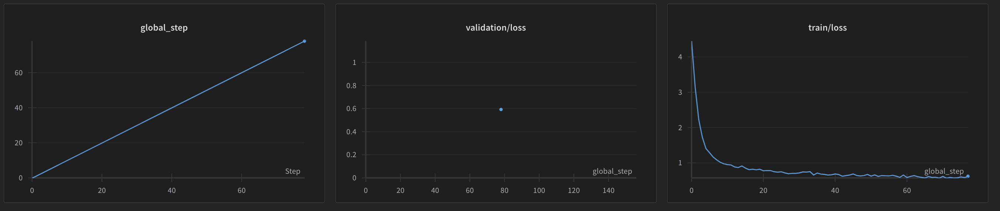
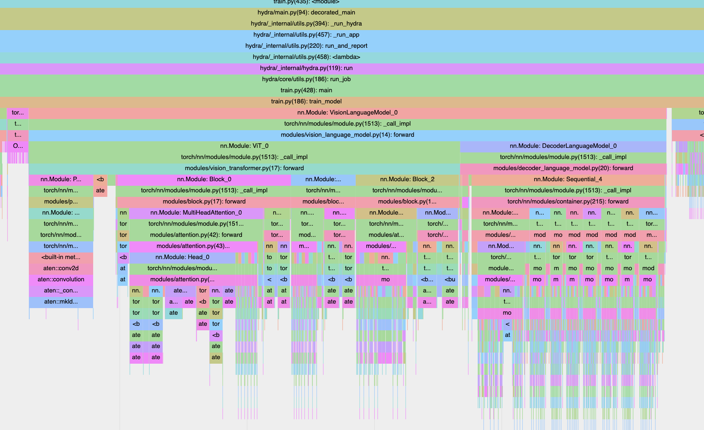
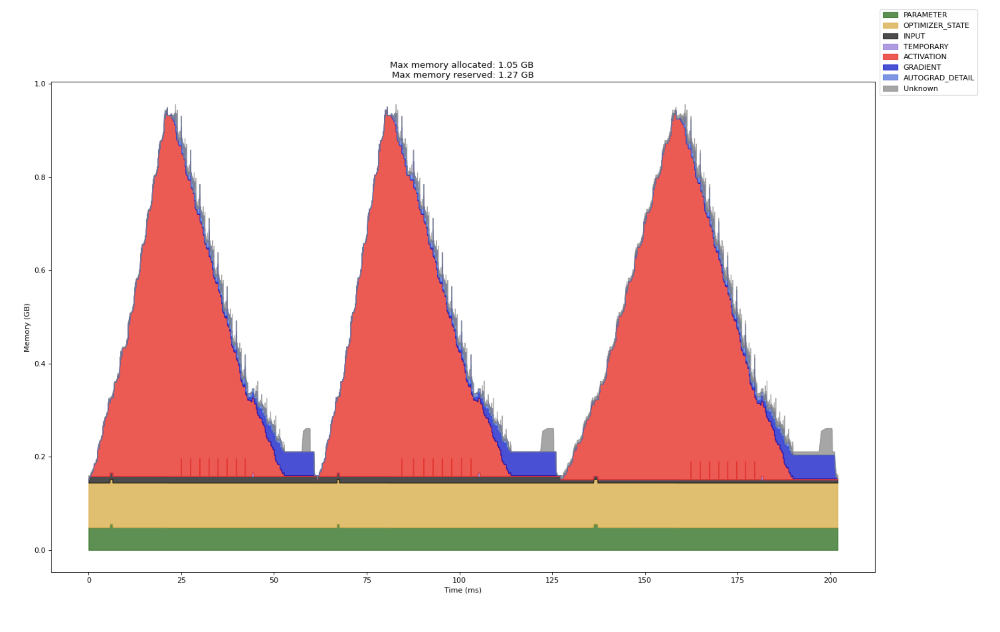
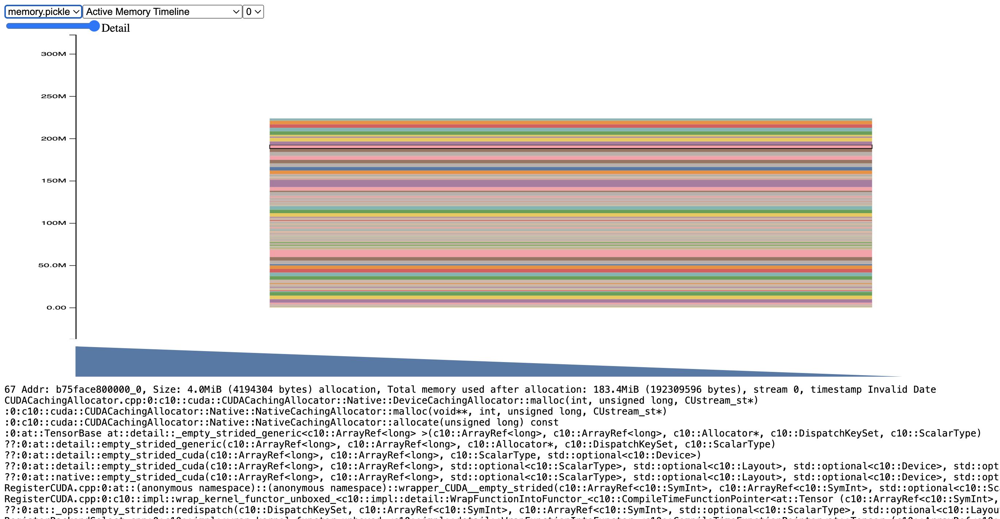
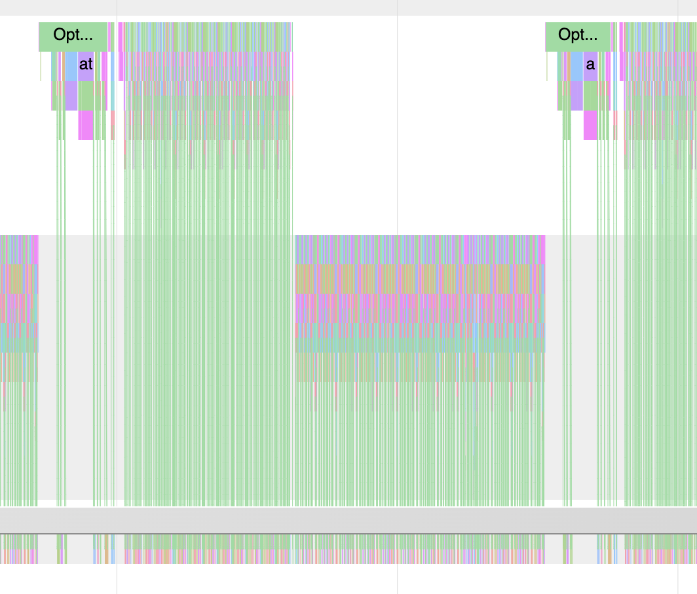
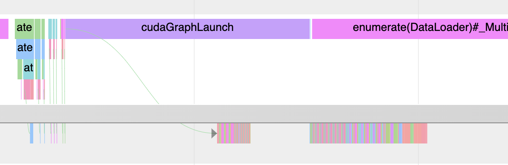
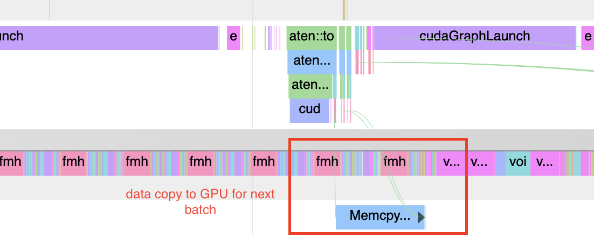

# Setup

Install dependencies

```
pip install -r requirements.txt
```

To download COCO dataset, the script will download from HuggingFace, so log into HF:

```
huggingface-cli login
```

# Run locally:

```
python train.py
```

# Run with Weights and Biases:

```
python train.py trainer_config.use_wandb=True
```

<div align="center">
    
</div>

# Single-node DDP training on multiple GPUs:

```
torchrun --standalone --nproc_per_node=gpu --rdzv_id=456 --rdzv_backend=c10d --rdzv_endpoint=127.0.0.1:48123 train.py
```

DDP currently works with AMP (Automatic Mixed Precision) training (enabled by default) but not with CUDA graph.

---

# Changing run configs with Hydra

I use [Hydra](https://hydra.cc/) to manage run configs. Currently I provide 2 train configs:

- `coco_train.yaml` to train on subset of COCO captions [RIW/small-coco](https://huggingface.co/datasets/RIW/small-coco)
- `csv_train.yaml` to infinitely sample from `images/inputs.csv` containing 3 b64-encoded image and caption pairs.

You can use a different `.yaml` config file by specifying `--config-name` and `--config-path`

---

# Profiling

Training script uses PyTorch's built-in profiler. By default, no profiling is performed as it degrades performance.

Tracing can be enabled by running with `trainer_config.profiler_mode=trace` to perform tracing and export a trace that can be viewed on chrome by loading the `.json.gz` file on `chrome://tracing`. An example trace:

<div align="center">
    
</div>

By running `train.py` with `trainer_config.profiler_mode=memory`, you can also enable memory profiling, which will additionally export a `.html` file with a memory timeline plot embedded as a PNG file.

<div align="center">
    
</div>

PyTorch also provides a way to generate memory snapshots for CUDA (see https://pytorch.org/docs/stable/torch_cuda_memory.html), which can be viewed loaded at [pytorch.org/memory_viz][pytorch.org/memory_viz]. However, I have not included these in my script because it didn't seem to record the CUDA memory allocations correctly. Example:

<div align="center">
    
</div>
```

**NOTE**: If running into issues when enabling `memory` profiling, try removing the profiling scheduler and run on smaller iterations with `trainer_config.max_iters=10` (or any small number).

---

# Performance optimizations

All perf timings below were carried out on 1 x RTX 4000 Ada GPU unless specified otherwise (e.g. multi-GPU training)

## Faster Dataloaders

Setting `num_workers` to be >0 (I've used 4) and setting `pin_memory=True` helps dataloading speed significantly.

On 1 epoch, 155 iterations run of COCO dataset, here are the total training durations before and after:

Before: **26.52 seconds**

After: **15.75 seconds**

Speedup: **1.68x**

## CUDA Graph

This is an optimization that helps if using a low batch size such that training is mostly CPU bound.

When I initially checked the trace for a run with batch_size=16, I saw that we have low GPU utilisation with CPU launching many short kernels:

<div align="center">
    
</div>

Enabling CUDA graph give signficant performance here as it will record the kernel and replay this on the GPU without CPU launch overhead.
See [this link](https://pytorch.org/docs/stable/notes/cuda.html#cuda-graphs) for more info about CUDA graphs.

After enabling CUDA graph on whole model, we see one single CUDA graph launch:

<div align="center">
    
</div>

We get less CPU <-> GPU data transfers (notice how GPU kernels are packed close together now). We even get to overlap some of the GPU compute with CPU compute for data loading.

Using COCO dataset with batch size of 16, we get a decent speed improvement.

Without CUDA graph enabled

```
python train.py trainer_config.cuda_graph=True trainer_config.use_amp=False trainer_config.train_batch_size=16
```

Results:

```
[rank 0] epoch 0, step 617, dt: 34.2877ms
[rank 0] epoch 0, step 618, dt: 34.3411ms
Epoch 0 running validation at global step 619
Validation Loss after epoch 0: 0.47926136255264284
[rank 0] Training time took 27.86 seconds
```

With CUDA graph enabled:

```
[rank 0] epoch 0, step 617, dt: 21.7195ms
[rank 0] epoch 0, step 618, dt: 21.7261ms
Epoch 0 running validation at global step 619
Validation Loss after epoch 0: 0.4788641661405563
[rank 0] Training time took 19.62 seconds
```

Time taken for each iteration went from 34ms -> 21ms, and total training time reduced from 27s -> 19s. For some reason, full-model CUDA graph doesn't seem to be work with Automatic Mixed Precision with `torch.cuda.amp.autocast` so the run needs to disable amp: `python train.py trainer_config.cuda_graph=True trainer_config.use_amp=False`.

NOTE: To enable this on COCO dataset, I needed to pad each batch to have the same `trainer_config.max_seq_length` sequence length, as CUDA graph doesn't work if you have dynamic input shapes. I did some analysis of the COCO dataset and found that 255 is the max length across all ~8k training samples, but rounded it up to 256 since it's a nice power of 2.

## Prefetching data to overlap host->device data copy and compute

We can prefetch a batch with `data.to(non_blocking=True)` on a separate CUDA stream so CPU isn't blocked.

<div align="center">
    
</div>

### Enabling TensorFloat32 (TF32) mode

Ampere and later devices can do matrix multiplications faster using TF32. This is enabled by default for convolutions but not for matrix multiplications. Enabling these allow GPUs that support it to make use of Tensor Cores.

```
torch.backends.cuda.matmul.allow_tf32 = True
torch.backends.cudnn.allow_tf32 = True
```

On 1 x RTX 4000 Ada GPU, I got a good speed up from enabling this:

Without TF32:

```
[rank 0] epoch 0, step 153, dt: 87.7135ms
[rank 0] epoch 0, step 154, dt: 88.4426ms
Epoch 0 running validation at global step 155
Validation Loss after epoch 0: 0.543974132835865
[rank 0] Training time took 18.99 seconds
```

With TF32:

```
[rank 0] epoch 0, step 153, dt: 74.3794ms
[rank 0] epoch 0, step 154, dt: 74.4398ms
Epoch 0 running validation at global step 155
Validation Loss after epoch 0: 0.5439731180667877
[rank 0] Training time took 17.03 seconds
```

### bf16/fp16 mixed precision training

These are applied with `torch.cuda.amp.autocast` and toggled with `trainer_config.use_amp=True/False`. Fpr fp16, we need to scale the gradients accordingly. The training script uses bf16 if the hardware supports it.

For mixed precision training to have non-trivial speed ups, we need to saturate the GPU. For COCO dataset (`--config-name coco_train.yaml`), I tried BF16 autocasting on batch size of 64 and saw further performance improvements compared to the with-TF32 baseline above.

With BF16 (+TF32):

```
python train.py trainer_config.use_amp=True
...
[rank 0] epoch 0, step 151, dt: 40.9811ms
[rank 0] epoch 0, step 152, dt: 40.4835ms
[rank 0] epoch 0, step 153, dt: 37.3769ms
[rank 0] epoch 0, step 154, dt: 39.1674ms
Epoch 0 running validation at global step 155
Validation Loss after epoch 0: 0.5439773529767991
[rank 0] Training time took 12.44 seconds
```

Time taken for each iteration went from ~74ms -> ~40ms, with total training time for 155 iterations reducing from 17->12 seconds.

**NOTE**: Currently CUDA graph doesn't seem work with AMP, so the script will fail if `cuda_graph=True` and `use_amp=True` on least on RTX 4000 Ada.

## (Potentially) improved convolution performance

Enable NVIDIA cuDNN auto-tuner:

```
torch.backends.cudnn.benchmark = True
```

The auto-tuner will run a short benchmark and select kernel w/ best perf given model inputs. However, I didn't see much difference in performance in practice, perhaps because convolutions in ViT are a relatively small part of the overall VLM.

## torch.compile

We don't need it for a simple model like this, but `torch.compile` can also generate CUDA graphs automatically when running with `mode='reduce-overhead'`. However, this mode causes `segmentation fault` for this model and I haven't had time to debug why :p

In my experiments, `torch.compile` didn't result in a significant speed up, likely because the model is already quite simple. Nevertheless, I added a flag to run training with `mode='default'` torch.compile:

```
python train.py 'trainer_config.compile=True'
```

NOTE: first forward pass will be significantly slower as Pytorch has to first compile the model.

NOTE: original script uses batch size of 16 for train, and 8 for validation. The different input shape will trigger recompile during when calculating validation loss unless we make batch size the same for train and validation

## Flash Attention

Current model uses custom multi-head attention modules in `modules/attention.py`.

I rewrote this to use `F.scaled_dot_product_attention`, which uses FlashAttention (FA) by default. This results in significant speed up, especially at larger batch sizes. The comparion below is for `batch_size=64` and `use_graph=True`:

```
python train.py trainer_config.cuda_graph=False trainer_config.use_amp=True
```

With batch_size=64 and **not** using FlashAttention:

```
[rank 0] epoch 0, step 153, dt: 116.4682ms
[rank 0] epoch 0, step 154, dt: 116.1888ms
Epoch 0 running validation at global step 155
Validation Loss after epoch 0: 0.5457157269120216
[rank 0] Training time took 26.54 seconds
```

Switching to FlashAttention implementation

```
[rank 0] epoch 0, step 153, dt: 43.6299ms
[rank 0] epoch 0, step 154, dt: 43.6220ms
Epoch 0 running validation at global step 155
Validation Loss after epoch 0: 0.5439692437648773
[rank 0] Training time took 12.10 seconds
```

Switching to FA (on single RTX 4090) reduces each iteration from **110ms -> 43ms**, 2.5x improvement.

## DistributedDataParallel training

I use 2 x RTX4090 to run DDP training, with batch size of 64.

Single-node GPU training:

```
[rank 0] epoch 0, step 153, dt: 45.4826ms
[rank 0] epoch 0, step 154, dt: 45.5353ms
Epoch 0 running validation at global step 155
Validation Loss after epoch 0: 0.5439750000834465
[rank 0] Training time took 11.99 seconds
```

With DDP:

```
[rank 1] epoch 0, step 76, dt: 98.8824ms
[rank 0] epoch 0, step 77, dt: 98.8553ms
[rank 1] epoch 0, step 77, dt: 98.9511ms
[rank 1] Training time took 14.26 seconds
Epoch 0 running validation at global step 78
Validation Loss after epoch 0: 0.5921480029821395
[rank 0] Training time took 15.39 seconds
```

Each iteration now takes ~98ms up from ~70ms for single-node training, due to DDP overhead such as All-Reduce on backward. However, there are now 2 GPUs each processing half the number of batches (155). With 2 GPUs, single-node training seems faster, though it probably can be optimized further.

One added benefit of DDP is that you can process the same amount of data per iteration by using a smaller batch size on each rank, which reduces the memory of activations (which is proportional to batch size).

## Final results

On a single RTX 4000 Ada GPU, training on COCO training data of ~8k samples with batch size 64 for 1 epoch takes \_\_ seconds **without** the aforementioned performance optimizations:

```
[rank 0] epoch 0, step 153, dt: 133.6944ms
[rank 0] epoch 0, step 154, dt: 108.5243ms
Epoch 0 running validation at global step 155
Validation Loss after epoch 0: 0.5456113658845425
Epoch 0 | Saved training snapshot at /root/seemore/seemore-submission-main/snapshots/00_snapshot.pt
[rank 0] Training time took 41.11 seconds
```

Final results, combining perf results discussed above (but without CUDA graph / compile, using mixed precision bf16). Results when running on 2 x RTX 4000 Ada GPUs:

```
[rank 0] epoch 0, step 77, dt: 98.5072ms
[rank 1] epoch 0, step 77, dt: 98.4292ms
[rank 1] Training time took 13.58 seconds
Epoch 0 running validation at global step 78
Validation Loss after epoch 0: 0.5921374052762985
Epoch 0 | Saved training snapshot at /root/seemore/seemore-submission-main/snapshots/00_snapshot.pt
[rank 0] Training time took 14.31 seconds
```

For single (1 x RTX 4000 Ada) GPU training:

```
[rank 0] epoch 0, step 153, dt: 44.0307ms
[rank 0] epoch 0, step 154, dt: 47.2314ms
Epoch 0 running validation at global step 155
Validation Loss after epoch 0: 0.5439842417836189
Epoch 0 | Saved training snapshot at /root/seemore/seemore-submission-main/snapshots/00_snapshot.pt
[rank 0] Training time took 12.56 seconds
```

DDP training:


https://github.com/user-attachments/assets/85d101da-5ef9-441f-9f97-4d636e8b55ae


---

# TODO

Below is a list of ideas for improvement that I did have time to get to, but would try.

- Tensor cores on Volta+ GPUs prefer NHWC tensor layout, where channel dim is last.
  See https://docs.nvidia.com/deeplearning/performance/dl-performance-convolutional/index.html#tensor-layout.
- Didn't implement but useful for scaling: FSDP (ZeRO 3, sharding parameters, gradients and optimizer states), tensor parallelism, pipeline parallelism
- Make CUDA graph + DDP and CUDA graph + AMP work. Both don't work currently.

---

# Checklist

- [x] Configuring hyperparameters through CLI (e.g. using a yaml file and argparse)
  - Using Hydra
- [x] a simple solution (can be a any free library or service) for hyperparameter management and tracking
  - Weights and Biases can be used for hyperparam / experiment management
- [x] storing and visualizing the training loss
  - Weights and Biases
- [x] a simple solution for profiling the training performance to identify bottlenecks in the model configuration
  - PyTorch profiling
- [x] Include as many best practices into the training that you know of to ensure the fastest performance possible (i.e. half precision, ...)
  - See bullet points above
- [x] Extension of this training function in order to be scaleable to a multi-GPU or multi-node setting.
  - Supports DDP (Distributed Data Parallel) currently for multi-GPU and multi-node training runs
